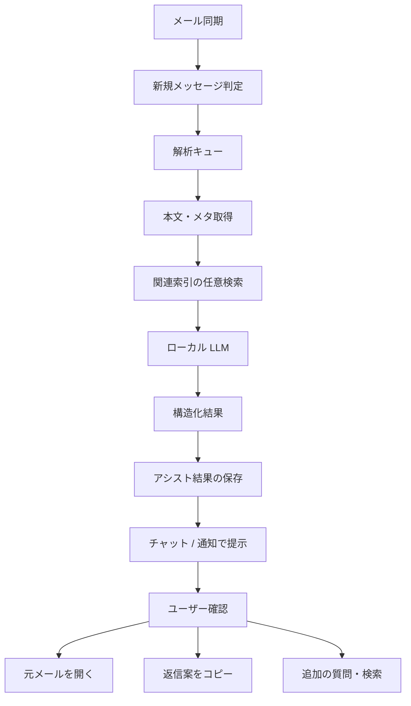

# 新着メール LLM アシスト — 実現可否とアーキテクチャ

最終更新: 2026-08-19  
状態: **検討のみ（未実装）**。実装タスクではない。

前提の回答:

- 対象: **Outlook Classic COM**（既存 Argos メール連携の延長）。Outlook.com / Microsoft Graph は対象外
- ゴール: 実現可否とアーキテクチャの整理。本ドキュメントはその成果物

関連:

- メール同期: [`src-tauri/src/mail/`](../src-tauri/src/mail/)（`outlook_com.rs` / `sta_worker.rs` / `sync.rs`）
- LLM: [`src-tauri/src/llm/`](../src-tauri/src/llm/)、[llm-chat-phase4-onward.md](llm-chat-phase4-onward.md)
- チャット UI: [`src/features/chat/`](../src/features/chat/)（````choices` によるソフトアクション）

---

## 結論

**作れる。既存の Outlook Classic COM 同期とローカル LLM チャットを組み合わせれば、クラウド Graph API なしで実現できる。**

ただし現状は「索引用の定期ポーリング」と「ユーザーが起動する対話チャット」まで。**新着をトリガにした自動 LLM ジョブ・構造化アクション・返信下書きの書き戻しはまだない。** MVP は既存部品の配線が中心で、リアルタイム性や Outlook 下書き作成は段階的に足すのが妥当。

---

## いまあるもの / ないもの

| 能力 | 現状 |
|------|------|
| Outlook Classic から件名・本文・差出人・会話 ID・受信時刻を取得 | あり（COM） |
| 選択フォルダの索引化（Tantivy + SQLite） | あり |
| 手動同期 / 定期同期（既定 3600 秒、0 で手動のみ） | あり |
| メールを LLM ツール検索・出典添付 | あり（`search_index` / `read_unit` / `llm_attach_sources`） |
| 選択肢 UI（````choices` → 入力欄置換） | あり |
| 元メールを Outlook で開く | あり（`open_mail_item`） |
| NewMail / ItemAdd などの COM イベント購読 | **なし**（ポーリングのみ） |
| 同期後の「新規メッセージ一覧」イベント | **なし**（集計 `indexed` のみ） |
| バックグラウンド自動 LLM 解析 | **なし** |
| 構造化アクション（返信案・期限・担当など）の型 | **なし** |
| Outlook 返信下書きの作成 / 送信 | **なし** |
| OS / トレイ通知 | **なし**（トレイメニューのみ） |

抽出していない主なフィールド: To/Cc、未読、重要度、添付、SMTP アドレス。

---

## 目標フロー（論理）



原則:

1. **自動送信しない。** 返信案・アクションは提案まで。送信は人が Outlook 側で行う
2. **メール本文はローカル索引と設定済み LLM サーバにだけ渡す。** Graph / クラウド ChatGPT は使わない（製品方針。URL のループバック強制はこの機能だけの追加ポリシー候補）
3. **チャットの対話経路とジョブ経路を分ける。** ユーザーが会話中でもジョブが詰まらないようキュー化する

---

## 推奨アーキテクチャ（Argos 内）

### コンポーネント

| 層 | 役割 | 置き場所の目安 |
|----|------|----------------|
| 検知 | 同期で「新規 indexed」になったメッセージを列挙 | `mail/sync` または `sta_worker` の後処理 |
| キュー | 重複排除・優先度・同時実行 1・失敗リトライ | 新規 `mail_assist`（SQLite + ワーカ） |
| 解析 | 専用システムプロンプトで要約・抽出・アクション・返信案 | `llm` の非 UI 呼び出し（`llm_send` 相当を内部 API 化） |
| 結果 | メッセージ path に紐づく JSON 結果 | SQLite 新表（例: `email_assist`） |
| 提示 | チャットスレッド自動作成、または専用パネル + ````choices` | `src/features/chat` または軽い専用 UI |
| アクション実行 | 元メール表示、返信案をクリップボード、（将来）下書き COM | 既存 `open_mail_item` + 新規 |

### 新着の判定

現状の指紋スキップ（`content_hash` + Tantivy 存在）をそのまま使える。

- 同期パスで **今回初めて `indexed` になった** `outlook:{storeId}/{entryId}` をリスト化
- `mail-sync-progress` に加えて、例: `mail-new-messages` イベント、または DB に `assist_status=pending` を立てる
- 間隔は既存 `mail_sync_interval_secs` に依存。近リアルタイムが要るなら間隔短縮か、後述の COM イベントを検討

ポーリングの限界:

- 遅延は同期間隔まで（既定 1 時間）
- バックグラウンド同期は Outlook 未起動だとスキップ（`allow_launch: false`）
- 毎回フォルダ Restrict 全件寄りで、巨大メールボックスでは重い

**MVP はポーリングのままで十分。** 「届いた瞬間」が必須なら、別フェーズで `Items.ItemAdd` / Application イベントの STA 購読を検討する（実装コスト・Outlook バージョン差・STA スレッド制約が大きい）。

### LLM 入出力（案）

入力:

- 件名、差出人、受信時刻、フォルダ、本文（長さ上限で truncate）
- 任意: 同一 `conversation_id` の直近数通
- 任意: ツールで関連ファイル・過去メールを数件（既存 `search_index`）

出力（JSON 推奨。チャット表示用に Markdown も併記可）:

```json
{
  "summary": "一文要約",
  "key_facts": ["期限", "依頼内容", "金額・当事者など"],
  "urgency": "low|normal|high",
  "suggested_actions": [
    { "id": "open", "label": "元メールを開く" },
    { "id": "search", "label": "関連資料を探す", "query": "..." },
    { "id": "reply", "label": "返信案を使う" }
  ],
  "reply_draft": "返信本文の下書き",
  "questions": ["確認が必要な点"]
}
```

UI では当面、構造化結果を Markdown + ````choices` に落としてもよい（既存のクリック→入力欄置換）。型付きアクションは後から厳密化できる。

### プライバシー / 負荷

- 設定フラグ例: `mail_assist_enabled`（既定 off）
- 対象フォルダは既存の選択フォルダに合わせる（全受信を無差別に投げない）
- フィルタ候補: 未読のみ（要 COM 拡張）、差出人ドメイン、件名キーワード、手動「このメールを解析」
- LLM ビジー時はキュー待ち。同期自体はブロックしない
- 本文をクラウド URL に送る場合の警告、またはこの機能に限り loopback 必須

### 返信案の届け方（段階）

1. **MVP:** チャットに返信案を表示 → クリップボードコピー / 入力欄へ流し込み。送信は人が Outlook で
2. **次:** COM で Reply 下書きを作成して Outlook に残す（`MailItem.Reply` + `Save` 相当）。**Send は自動でやらない**
3. **不要ならやらない:** Graph 経由のクラウド下書き

---

## MVP スコープ（実装するときの切り方）

実装は本ドキュメントの範囲外だが、着手順の目安:

1. 同期後に新規 `path` 一覧を出せるようにする
2. `email_assist`（または同等）とバックグラウンド 1 ワーカ
3. メール専用プロンプトで要約・要点・返信案を生成し、専用または既存チャットに表示
4. ````choices` で「開く」「返信案をコピー」「関連を検索」
5. 設定: 有効/無効、対象、間隔は既存同期に追従

あえて後回し:

- COM NewMail イベント
- Outlook 下書き作成 / 送信
- OS 通知プラグイン
- To/Cc・添付の本格利用
- 未読フラグ同期

---

## リスクと制約

| リスク | 影響 | 緩和 |
|--------|------|------|
| 同期間隔による遅延 | 「届いたらすぐ」にならない | 間隔短縮、または後でイベント購読 |
| Outlook 未起動 | バックグラウンド同期が動かない | UI で明示、またはユーザー起動時のみアシスト |
| ローカル LLM の品質・遅延 | 返信案が粗い / キュー滞留 | 短い本文・JSON スキーマ・件数上限 |
| 法律事務所文脈の誤提案 | 誤った期限・当事者 | 出典必須、自動送信禁止、人が確認 |
| STA / COM の複雑さ | イベント購読で不安定化 | MVP はポーリング維持 |
| 新 Outlook（Store） | COM 非対応 | 現状どおり Classic 前提を明記 |

---

## Graph / Outlook.com を選ばない理由（本方針）

今回の前提は Argos のローカル完結。Microsoft Graph は webhook 用の公開 HTTPS、OAuth、サブスクリプション更新が必要で、既存 COM 索引・ローカル LLM 方針と別系統になる。クラウドメール専用プロダクトなら別設計。Argos 延長なら COM + ポーリングが整合する。

---

## まとめ

- **実現可否: Yes（Outlook Classic COM + 既存ローカル LLM）**
- **最短経路:** 同期の新規 indexed → キュー → LLM 構造化 → チャット / choices で提示（自動送信なし）
- **足りない中核:** 新規メッセージの明示的ハンドオフ、バックグラウンド解析ジョブ、結果保存、提示 UX
- **後回しでよい:** COM リアルタイムイベント、Outlook 下書き COM、OS 通知、Graph

次に実装に進む場合は、上記 MVP 1–5 をタスク分解すればよい。
